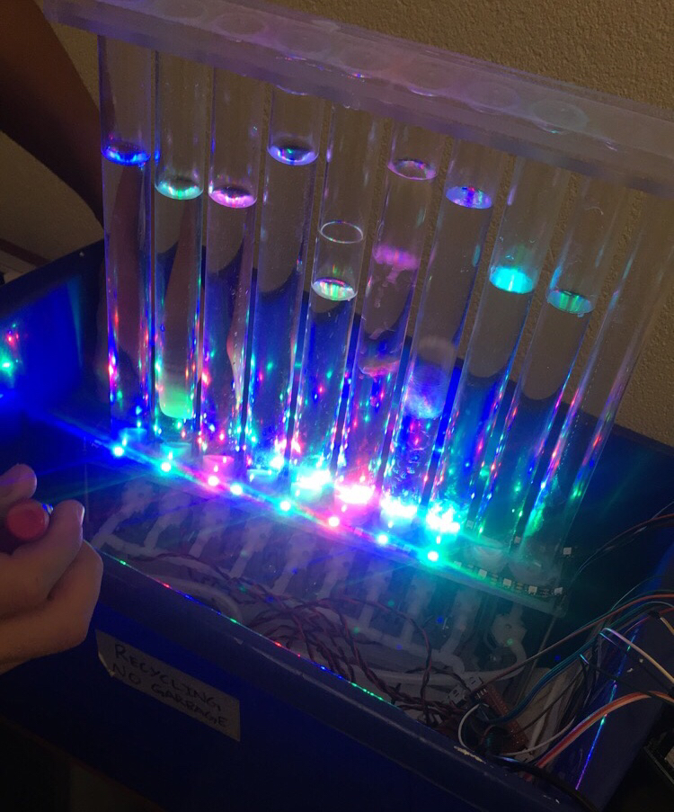

# bubbly

A programmable and interactive bubble wall display.

I worked on this project at HackThe6ix with my co-workers at KitchenMate (my first internship).

We ending up placing on the Top 10 out of over 70 teams.

The project consists of:
- a React web app that interfaces with the display via bluetooth.
- an Arduino microcontroller that sends signals to a transistor switch board after parsing bluetooth messages
- a transistor switch board that controls solenoid valves which allows air to enter the tubes
